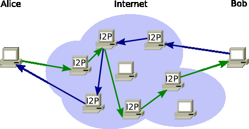

# 🧄 Гайд: Что такое I2P и зачем он нужен

Этот проект - подробный разбор того, как работает анонимная оверлейная сеть I2P, в чем суть чесночной маршрутизации и почему I2P считается одной из самых устойчивых децентрализованных систем.

---

## 1. Что такое I2P и как он появился?

### Об I2P
**I2P (Invisible Internet Project)** - это анонимная, децентрализованная, оверлейная сеть. Если Tor создавался в основном для того, чтобы анонимно выходить на обычные сайты (например, `google.com`), то I2P создана для общения **внутри самой сети** (eepsites - сайты с доменом `.i2p`, торренты, почта, чаты).

* **Как это работает:** Каждое устройство в сети I2P работает как маршрутизатор (клиент и узел одновременно).
* **Для чего:** Безопасная, устойчивая к цензуре и незаметная передача данных, где невозможно определить ни отправителя, ни получателя.

### История появления
Проект стартовал в **2003 году** как развитие идей Freenet и альтернатива Tor. Разработчики задались целью исправить главный недостаток централизованных сетей: сделать так, чтобы сеть не зависела от единых серверов или центральных каталогов (Directory Authorities).

### Почему это децентрализованный Open Source?
1. **Каждый пользователь - узел (Peer-to-Peer):** В I2P нет деления на простых пользователей и сервера. Подключаясь к сети, твой клиент автоматически начинает помогать пересылать зашифрованные куски чужого трафика. Чем больше людей в сети, тем она быстрее и безопаснее.
2. **Отсутствие единой точки отказа:** Сеть невозможно выключить, заблокировав центральный сервер, потому что центрального сервера не существует.

---

## 2. Как это устроено?

В отличие от луковой маршрутизации в Tor, I2P использует **чесночную маршрутизацию (Garlic Routing)** и однонаправленные туннели.

### Чесночная маршрутизация и туннели:
* **Однонаправленные туннели:** Трафик туда и трафик обратно идут по двум совершенно разным цепочкам узлов. Даже если кто-то сможет отследить один туннель, он не увидит ответный поток.
* **Чесночные зубчики (Garlic Message):** Данные объединяются в зубчики чеснока - один зашифрованный пакет может содержать сразу несколько разных сообщений (например, твой запрос к сайту + служебный запрос сети + чужое транзитное сообщение).

```


          

```

> **Важно:** В I2P используются не IP-адреса, а Cryptographic Keys (криптографические ключи). Сайт в сети `.i2p` - это буквально открытый публичный ключ, к которому подключается твой клиент.

---

## 3. Кто и зачем использует I2P?

I2P - это изолированный эко-мир со своими сервисами. В нем активно используют:

* **P2P и Торренты:** I2P идеально подстраивается под скачивание файлов через встроенный клиент (Snark), так как вся сеть работает по принципу Peer-to-Peer.
* **Анонимные сайты (Eepsites):** Хостинг внутренних сайтов без необходимости покупать домен или светить реальный сервер.
* **Защищенная почта и чаты:** Внутренняя зашифрованная почта (I2P-Bote) и мессенджеры, функционирующие без привязки к номерам телефонов.
* **Разработчики и криптографы:** Для тестирования распределенных приложений (dApps) и систем, устойчивых к блокировкам.

---

## 4. I2P vs Tor: В чем фундаментальная разница?

Многие считают их аналогами, но концепции у них принципиально разные.

| Характеристика | Tor | I2P |
| --- | --- | --- |
| **Основная цель** | Выход в обычный интернет (Clearnet) | Работа ВНУТРИ анонимной сети (Eepsites) |
| **Маршрутизация** | Луковая (Onion Routing) | Чесночная (Garlic Routing) |
| **Туннели** | Двунаправленные (один путь) | Однонаправленные (разные пути туда/обратно) |
| **Архитектура** | Серверы каталогов (Есть централизация) | Полностью децентрализованная P2P (DHT / NetDB) |
| **Оптимизация** | Под веб-серфинг и просмотр страниц | Под P2P, файлообмен и внутренние сервисы |

> **Суть:** Tor - это способ скрытно выйти из дома в город. I2P - это построение целого подземного города, где все дома связаны секретными туннелями.

---

## 5. Мифы и реальные риски

* **Миф "I2P - это просто медленный Tor".** **Реальность:** Нет, это совершенно другая архитектура. Первые 10-15 минут после запуска I2P-клиент вообще может работать очень медленно, потому что он только строит туннели и ищет соседей (NetDB). Но со временем скорость стабилизируется.
* **Риск Выхода в обычный интернет (Outproxy).** В I2P есть возможность открывать обычные сайты (через Outproxy), но это слабое место. Серверов-шлюзов мало, и они могут прослушиваться.
* *Совет:* Используй I2P строго для внутренних `.i2p` ресурсов, а для обычного интернета используй Tor.


* **Нагрузка на железо и сеть.** Так как твой ПК становится частью сети и пересылает чужие зашифрованные пакеты, I2P потребляет больше трафика и ресурсов процессора, чем Tor Browser.

---

*Этот гайд подготовлен в ознакомительных целях.*

[Официальный сайт I2P](https://geti2p.net)
